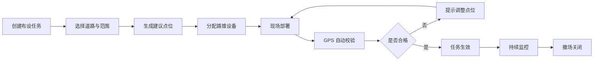

# 智能路锥道路管理调度中心网站功能设计文档

## 1. 文档定位

本文档基于《面向智能驾驶辅助的智能路锥系统项目报告》整理，用于指导“智能路锥道路管理调度中心”网站 Demo 的功能设计。

网站不只展示路锥位置，而是将智能路锥采集到的视觉、定位、雷达测距和状态上传信息转化为道路管理动作，帮助管理人员完成临时施工、事故隔离、临时封路、恶劣天气低能见度等场景下的发现、研判、调度、同步和复盘。

## 2. 产品概述

### 2.1 产品名称

智能路锥道路管理调度中心

### 2.2 产品定位

面向道路管理单位、施工维护单位、交通应急人员和智能交通平台的 Web 调度系统。

它以智能路锥为前端信息节点，以地图为主要工作界面，将道路临时变化信息从“现场人工上报”升级为“路锥主动感知 + 平台实时调度 + 车辆端提前预警”。

### 2.3 核心价值

1. 将传统路锥从静态警示设施升级为可管理、可定位、可预警的信息节点。
2. 将施工、事故、封路等临时道路状态实时同步到平台，减少信息滞后。
3. 利用摄像头、GPS、雷达等多源数据弥补单车智能在遮挡、夜间、雨雾、弯道等场景中的感知盲区。
4. 帮助道路管理人员快速发现异常、判断风险等级、派发处置任务、同步地图或车辆预警。
5. 沉淀历史事件、风险热区和设备运行数据，为后续交通安全优化提供依据。

## 3. 设计目标

### 3.1 业务目标

1. 快速发现临时道路风险：施工占道、事故隔离、障碍物、车辆接近、行人闯入、路锥偏移等。
2. 准确掌握现场范围：通过多个路锥 GPS 点位形成施工区、封控区、事故区和缓冲区边界。
3. 实时监控现场态势：持续查看车辆接近距离、现场目标识别结果、路锥在线状态和风险等级。
4. 辅助调度处置：根据风险等级自动生成处置建议，并支持派单、确认、升级和关闭。
5. 对外同步道路信息：将道路状态推送至地图平台、车端预警系统或管理接口。
6. 支持事后复盘：保留事件轨迹、预警记录、处置过程、现场截图和设备数据。

### 3.2 Demo 目标

Demo 阶段重点表现“调度中心”的完整业务闭环，不追求所有硬件真实接入，但要让用户清楚看到智能路锥数据如何服务道路管理。

1. 地图可视化展示路锥、道路事件、风险区域和预警范围。
2. 支持模拟路锥上传 GPS、摄像头识别、雷达距离、在线状态等数据。
3. 支持创建和管理施工、事故、封路、恶劣天气四类典型事件。
4. 支持事件风险等级自动判断和人工确认。
5. 支持调度任务派发、处理进度跟踪和事件关闭。
6. 支持历史数据统计、告警回放和基础报表展示。

## 4. 用户角色

### 4.1 调度中心值班员

主要负责实时监控地图、查看告警、确认事件、派发任务、跟踪现场处置进度。

核心需求：

1. 第一时间看到哪里有风险。
2. 快速判断风险是否真实、是否需要升级。
3. 快速联系现场人员或生成处置任务。
4. 知道事件是否已同步给地图平台和车辆端。

### 4.2 道路施工 / 养护管理员

主要负责施工区域创建、路锥部署、现场状态维护和撤场确认。

核心需求：

1. 按道路作业计划布设路锥。
2. 查看路锥是否按计划形成安全边界。
3. 发现路锥偏移、缺失、离线、被碰撞等异常。
4. 记录施工开始、暂停、恢复和结束。

### 4.3 交通应急处置人员

主要负责事故隔离、突发封控、现场风险消除。

核心需求：

1. 快速创建临时事故区。
2. 查看后方车辆接近风险。
3. 接收平台任务和处置建议。
4. 上传现场处置结果。

### 4.4 系统管理员

主要负责设备管理、用户权限、接口配置、规则配置和系统运行维护。

核心需求：

1. 管理路锥设备档案。
2. 配置地图 API、车端预警 API、告警规则和区域规则。
3. 查看设备健康、数据上传质量和接口状态。

### 4.5 决策 / 管理人员

主要关注整体运行状态、风险统计、道路事件处理效率和设备投入效果。

核心需求：

1. 查看风险热力图和事件趋势。
2. 评估智能路锥对施工安全、事故响应和道路通行效率的帮助。
3. 形成报表用于管理汇报。

## 5. 数据来源与信息压榨策略

智能路锥的原始能力包括摄像头、GPS、雷达、树莓派主控和数据上传接口。网站设计需要尽可能从这些数据中提取管理价值。

### 5.1 GPS 定位数据

原始数据：

1. 路锥编号。
2. 经纬度。
3. 定位时间。
4. 定位精度。
5. 速度或位移变化，若 GPS 模块支持。

可提取信息：

1. 路锥实时位置。
2. 施工区或封控区边界。
3. 事故隔离区域范围。
4. 路锥是否被移动。
5. 路锥是否偏离计划布设点。
6. 路锥阵列是否完整。
7. 路锥之间距离是否过大，是否存在防护缺口。
8. 作业区域长度、宽度、占用车道数量。
9. 路锥撤场进度。
10. 事件影响道路方向和路段。

管理用途：

1. 自动生成临时管制区域。
2. 判断安全缓冲区是否充足。
3. 发现路锥被撞飞、被挪走、布设不规范等问题。
4. 将事件范围同步给地图平台或车端预警系统。

### 5.2 摄像头识别数据

原始数据：

1. 现场图像或视频帧。
2. 识别目标类型：车辆、行人、路障、施工区域等。
3. 目标置信度。
4. 目标位置框。
5. 识别时间。

可提取信息：

1. 是否存在车辆靠近施工区。
2. 是否有行人进入危险区域。
3. 是否存在非计划障碍物。
4. 路锥是否被遮挡。
5. 现场能见度是否下降。
6. 夜间或雨雾条件下画面质量是否异常。
7. 现场作业是否仍在进行。
8. 事故区是否存在二次碰撞风险。
9. 车流密度变化。
10. 道路是否恢复可通行。

管理用途：

1. 为告警提供现场证据。
2. 辅助值班员判断告警真实性。
3. 自动生成风险截图。
4. 判断事件是否可以降级或关闭。
5. 支持事后复盘。

### 5.3 雷达测距数据

原始数据：

1. 障碍物距离。
2. 距离变化趋势。
3. 最近目标距离。
4. 检测时间。

可提取信息：

1. 是否有车辆快速接近。
2. 目标距离是否进入危险阈值。
3. 接近速度是否异常。
4. 车辆是否停留在缓冲区。
5. 是否存在近距离碰撞风险。
6. 路锥附近是否出现新障碍。
7. 雷达与视觉识别结果是否一致。

管理用途：

1. 触发近场碰撞预警。
2. 对摄像头受雨雾、夜间影响时进行补充判断。
3. 判断施工人员或设备周边安全距离。
4. 生成“车辆接近趋势”曲线，辅助风险升级。

### 5.4 主控融合数据

树莓派主控可以对多传感器数据进行融合，并上传结构化状态。

可提取信息：

1. 设备在线 / 离线状态。
2. 最近一次上报时间。
3. 数据延迟。
4. 传感器工作状态。
5. 识别结果与雷达结果是否冲突。
6. 当前风险等级。
7. 当前事件类型。
8. 上报失败次数。

管理用途：

1. 区分真实道路风险和设备异常。
2. 发现数据中断、设备故障、接口异常。
3. 提高告警可信度。
4. 为调度中心生成设备健康评分。

### 5.5 外部平台数据

虽然项目报告重点是智能路锥，但网站 Demo 可以预留外部数据入口，用于增强道路管理能力。

建议接入或模拟：

1. 高德地图底图和道路名称。
2. 天气和能见度信息。
3. 道路车流速度。
4. 施工计划台账。
5. 交通管制计划。
6. 车辆端预警回执。

用途：

1. 将路锥点位匹配到真实道路。
2. 在雨、雾、雪、夜间低能见度场景下自动提高风险等级。
3. 判断施工区是否导致拥堵。
4. 校验现场布设是否符合计划。

## 6. 总体业务闭环


业务闭环说明：

1. 路锥上传位置、识别结果和距离信息。
2. 平台将多个路锥关联为一个道路事件。
3. 系统根据区域范围、目标识别、接近距离和数据时效判断风险。
4. 调度员确认或修正事件类型、等级和范围。
5. 系统生成处置任务并推送给现场人员。
6. 现场人员处理后反馈状态。
7. 平台将道路状态同步给地图或车辆端。
8. 事件结束后形成复盘记录。

## 7. 信息架构

网站一级导航建议如下：

1. 态势总览
2. 地图调度
3. 事件中心
4. 告警中心
5. 路锥设备
6. 布设任务
7. 车辆预警
8. 数据分析
9. 复盘报告
10. 系统配置

## 8. 页面与功能设计

### 8.1 态势总览

页面目标：

让值班员在 10 秒内理解当前道路临时风险态势。

核心组件：

1. 实时地图缩略区。
2. 今日事件数量。
3. 当前高风险事件数量。
4. 在线路锥数量。
5. 离线路锥数量。
6. 正在施工区域数量。
7. 事故隔离区域数量。
8. 临时封路区域数量。
9. 近 1 小时车辆接近告警数量。
10. 地图 / 车端同步状态。

关键功能：

1. 显示全局风险等级。
2. 按道路、行政区、事件类型筛选。
3. 高风险事件自动置顶。
4. 点击指标跳转到对应列表。
5. 显示最新告警时间线。
6. 显示设备健康趋势。
7. 显示今日已关闭事件数量和平均处置时长。

Demo 建议：

1. 页面顶部展示“当前道路运行态势”指标组。
2. 中部展示地图加右侧实时告警列表。
3. 底部展示事件趋势折线图和风险类型占比图。

### 8.2 地图调度

页面目标：

作为网站核心工作台，用地图承载路锥、事件、风险区域和调度操作。

地图图层：

1. 路锥点位图层。
2. 施工区域图层。
3. 事故隔离图层。
4. 临时封路图层。
5. 恶劣天气风险图层。
6. 车辆接近预警范围图层。
7. 路锥计划布设点图层。
8. 路锥实际布设点图层。
9. 告警热力图层。
10. 已同步地图平台的道路状态图层。

路锥点位状态：

1. 绿色：在线正常。
2. 黄色：低风险异常，如定位漂移、识别置信度低。
3. 橙色：中风险异常，如路锥偏移、车距过近。
4. 红色：高风险异常，如车辆快速接近、行人闯入、设备离线且处于高风险事件中。
5. 灰色：离线。

地图交互：

1. 点击路锥查看设备详情。
2. 点击事件区域查看事件详情。
3. 框选多个路锥生成临时事件。
4. 拖拽调整事件边界。
5. 测量路锥间距。
6. 查看路锥布设是否形成连续安全边界。
7. 开启 / 关闭图层。
8. 地图播放历史回放。
9. 一键定位高风险告警。
10. 一键生成对外同步信息。

地图右侧信息面板：

1. 当前选中对象。
2. 事件类型。
3. 风险等级。
4. 涉及路锥数量。
5. 最近上报时间。
6. 摄像头识别结果。
7. 雷达最近距离。
8. GPS 定位精度。
9. 处置状态。
10. 推荐操作。

### 8.3 事件中心

页面目标：

统一管理施工、事故、封路和恶劣天气相关道路临时事件。

事件类型：

1. 道路施工。
2. 交通事故。
3. 临时封路。
4. 交通管制。
5. 恶劣天气低能见度。
6. 路障 / 异物。
7. 路锥阵列异常。
8. 车辆异常接近。
9. 行人进入危险区。

事件状态：

1. 待确认。
2. 处置中。
3. 已同步。
4. 已降级。
5. 待关闭。
6. 已关闭。

事件详情字段：

1. 事件编号。
2. 事件类型。
3. 事件等级。
4. 发生道路。
5. 起止位置。
6. 影响方向。
7. 影响车道。
8. 关联路锥。
9. 首次发现时间。
10. 最近更新时间。
11. 现场识别结果。
12. 最近车辆距离。
13. 路锥边界完整度。
14. 处置负责人。
15. 对外同步状态。
16. 附件和截图。

核心功能：

1. 自动生成事件：多个路锥在同一区域连续上报异常时，系统自动生成事件。
2. 手动创建事件：调度员可以根据电话、巡检或施工计划创建事件。
3. 事件合并：相邻路锥告警可合并为同一施工或事故事件。
4. 事件拆分：一个大范围施工可以拆分成多个路段管理。
5. 风险升级：当车辆距离持续缩短、行人闯入或设备离线时，自动升级。
6. 风险降级：当目标离开、距离恢复安全、现场确认后降级。
7. 事件关闭：必须满足风险解除、路锥撤场或道路恢复条件。
8. 事件时间线：记录从发现到关闭的所有操作。

### 8.4 告警中心

页面目标：

集中处理由路锥数据触发的实时风险。

告警分类：

1. 车辆接近告警。
2. 行人闯入告警。
3. 路锥偏移告警。
4. 路锥离线告警。
5. 目标识别异常告警。
6. 雷达距离异常告警。
7. 施工边界缺口告警。
8. 低能见度风险告警。
9. 地图同步失败告警。
10. 设备数据延迟告警。

告警等级：

1. 低：需要关注，不影响当前处置。
2. 中：需要确认，可能影响现场安全。
3. 高：需要立即派单或通知现场。
4. 紧急：存在碰撞、二次事故或人员风险，需要立即处置并外部同步。

告警详情：

1. 告警编号。
2. 告警类型。
3. 触发规则。
4. 关联路锥。
5. 关联事件。
6. 触发时间。
7. 当前距离。
8. 距离变化趋势。
9. 视觉识别结果。
10. 现场截图。
11. 建议处置动作。
12. 处理人。
13. 处理结论。

处理动作：

1. 确认为真实风险。
2. 标记为误报。
3. 升级事件等级。
4. 派发现场任务。
5. 推送车端预警。
6. 推送地图平台。
7. 暂时忽略。
8. 关闭告警。

### 8.5 路锥设备

页面目标：

管理所有智能路锥设备，确保每个路锥可追踪、可维护、可调度。

设备档案字段：

1. 设备编号。
2. 设备名称。
3. 设备型号。
4. 所属单位。
5. 当前状态。
6. 当前经纬度。
7. 最近上报时间。
8. 摄像头状态。
9. GPS 状态。
10. 雷达状态。
11. 主控状态。
12. 当前关联事件。
13. 当前所属任务。
14. 累计在线时长。
15. 累计告警次数。

设备状态：

1. 库存。
2. 待部署。
3. 已部署。
4. 运行中。
5. 异常。
6. 离线。
7. 维护中。
8. 已退役。

核心功能：

1. 设备列表查询。
2. 设备地图定位。
3. 设备详情查看。
4. 设备分组管理。
5. 设备状态切换。
6. 设备维护记录。
7. 设备数据回放。
8. 批量导入设备。
9. 批量关联施工任务。
10. 异常设备筛选。

### 8.6 布设任务

页面目标：

将路锥布设从人工经验管理升级为计划化、可校验、可追踪的流程。

任务类型：

1. 施工布设。
2. 事故临时布设。
3. 封路布设。
4. 恶劣天气预防布设。
5. 撤场任务。
6. 巡检任务。

任务流程：



核心功能：

1. 创建任务并选择道路范围。
2. 设置事件类型、影响方向、车道和预计时间。
3. 根据道路长度生成建议路锥数量。
4. 配置安全缓冲区。
5. 选择或自动分配路锥。
6. 现场部署后用 GPS 自动校验实际点位。
7. 判断路锥间距是否合理。
8. 判断路锥阵列是否形成连续边界。
9. 生成布设合格率。
10. 撤场时检查路锥是否全部回收。

### 8.7 车辆预警

页面目标：

将路锥发现的道路风险转化为车辆端可理解的提前预警信息。

预警对象：

1. 智能驾驶车辆。
2. 驾驶辅助系统。
3. 地图导航用户。
4. 后方来车。
5. 施工车辆和应急车辆。

预警内容：

1. 前方施工。
2. 前方事故。
3. 前方封路。
4. 前方车道减少。
5. 前方低能见度。
6. 前方路障。
7. 请减速。
8. 请变道。
9. 请绕行。

预警字段：

1. 事件编号。
2. 事件类型。
3. 风险等级。
4. 经纬度范围。
5. 影响方向。
6. 影响车道。
7. 建议速度。
8. 建议绕行。
9. 生效时间。
10. 失效时间。

核心功能：

1. 自动生成预警文本。
2. 根据风险等级设置预警半径。
3. 推送到地图平台或模拟车端。
4. 查看推送状态。
5. 查看车辆端回执。
6. 在事件关闭后自动撤销预警。

### 8.8 数据分析

页面目标：

将路锥长期运行数据转化为管理洞察。

分析主题：

1. 事件数量趋势。
2. 告警数量趋势。
3. 高风险路段排行。
4. 路锥设备在线率。
5. 告警处理时长。
6. 施工区边界完整度。
7. 车辆接近风险分布。
8. 误报率。
9. 地图同步成功率。
10. 事件关闭效率。

核心图表：

1. 事件趋势折线图。
2. 风险类型柱状图。
3. 高风险路段排行。
4. 告警热力图。
5. 设备在线率仪表盘。
6. 平均处置时长卡片。
7. 车辆最近距离分布图。
8. 事件生命周期漏斗。

管理用途：

1. 判断哪些路段经常出现临时风险。
2. 评估智能路锥部署是否有效。
3. 找出设备故障高发点。
4. 优化施工布设规范。
5. 支持项目展示和结题汇报。

### 8.9 复盘报告

页面目标：

对单个事件形成可追溯报告，服务安全复盘、管理汇报和责任确认。

报告内容：

1. 事件基本信息。
2. 事件地图范围。
3. 涉及路锥列表。
4. 首次发现方式。
5. 告警时间线。
6. 风险等级变化。
7. 现场截图。
8. 雷达距离曲线。
9. 处置任务记录。
10. 对外同步记录。
11. 事件关闭依据。
12. 复盘结论。

核心功能：

1. 自动生成报告。
2. 人工补充结论。
3. 导出 Markdown / PDF。
4. 对比同类历史事件。
5. 生成改进建议。

### 8.10 系统配置

页面目标：

为 Demo 和后续真实系统提供规则、接口和权限配置能力。

配置内容：

1. 告警阈值配置。
2. 风险等级规则配置。
3. 地图 API 配置。
4. 车端预警接口配置。
5. 设备上报接口配置。
6. 用户和角色权限。
7. 道路基础数据。
8. 事件类型字典。
9. 设备类型字典。
10. 日志和审计配置。

## 9. 核心功能模块逻辑

### 9.1 路锥自动成区

功能说明：

当多个智能路锥在相近时间、相近空间范围内上传位置后，系统自动将它们组成一个临时道路区域。

判断逻辑：

1. 路锥距离小于设定阈值。
2. 上报时间处于同一时间窗口。
3. 所属道路名称或道路方向一致。
4. 事件类型相同或未指定。

输出结果：

1. 区域边界。
2. 区域中心点。
3. 区域长度。
4. 影响车道。
5. 涉及路锥数量。
6. 边界完整度。

### 9.2 施工边界完整度判断

功能说明：

利用路锥 GPS 位置判断施工区是否存在防护缺口。

计算维度：

1. 路锥间距。
2. 路锥排列方向。
3. 起点和终点是否覆盖施工范围。
4. 是否存在偏离主线的点位。
5. 是否有设备离线导致边界不可确认。

输出结果：

1. 完整。
2. 存在轻微偏移。
3. 存在间距过大。
4. 存在明显缺口。
5. 无法判断。

推荐处置：

1. 调整偏移路锥。
2. 补充路锥。
3. 检查离线设备。
4. 现场复核。

### 9.3 车辆接近风险判断

功能说明：

结合雷达距离变化和摄像头车辆识别结果判断车辆是否存在碰撞或闯入风险。

风险规则示例：

1. 雷达距离小于 30 米：中风险。
2. 雷达距离小于 15 米：高风险。
3. 雷达距离持续缩短且摄像头识别到车辆：高风险。
4. 雷达距离小于 10 米且目标仍在接近：紧急风险。
5. 摄像头受影响但雷达持续检测到接近目标：保持风险并提示人工确认。

输出结果：

1. 当前最近距离。
2. 距离变化趋势。
3. 预计进入危险区时间。
4. 风险等级。
5. 建议动作。

### 9.4 行人和作业人员风险判断

功能说明：

利用摄像头识别行人或作业人员位置，判断是否进入车辆通行侧或危险缓冲区。

风险规则示例：

1. 行人出现在施工边界外侧：中风险。
2. 行人进入车辆通行方向缓冲区：高风险。
3. 行人与车辆接近风险同时出现：紧急风险。

推荐动作：

1. 通知现场负责人。
2. 推送附近车辆减速。
3. 升级事件等级。
4. 保留截图用于复盘。

### 9.5 路锥偏移与被撞判断

功能说明：

通过 GPS 点位变化判断路锥是否被移动、碰撞或布设不规范。

判断规则示例：

1. 当前点位偏离计划点位超过 3 米：轻微偏移。
2. 当前点位偏离计划点位超过 8 米：明显偏移。
3. 短时间内发生大位移：疑似碰撞或人为移动。
4. 多个连续路锥同时偏移：可能为整体施工区调整。

推荐动作：

1. 标记偏移路锥。
2. 通知现场复位。
3. 重新计算施工边界。
4. 若边界出现缺口则升级告警。

### 9.6 数据时效与设备可信度判断

功能说明：

调度中心需要知道数据是否可靠，避免使用过期信息指挥现场。

判断维度：

1. 最近上报时间。
2. GPS 精度。
3. 摄像头识别置信度。
4. 雷达数据连续性。
5. 上传失败次数。
6. 多传感器结果是否矛盾。

设备可信度等级：

1. 高：数据新鲜、定位准确、多传感器一致。
2. 中：部分数据延迟或置信度一般。
3. 低：数据缺失、定位漂移或传感器冲突。
4. 不可用：离线或长时间无上报。

### 9.7 对外同步规则

功能说明：

将平台确认的道路事件同步给地图平台、车辆端或管理接口。

可同步条件：

1. 事件已被系统生成并完成基本定位。
2. 风险等级达到中风险以上。
3. 事件范围明确。
4. 事件状态不是已关闭。
5. 数据时效满足要求，或已由人工确认。

同步内容：

1. 事件类型。
2. 事件范围。
3. 影响方向。
4. 建议动作。
5. 生效时间。
6. 预计结束时间。
7. 可信度。

撤销同步条件：

1. 事件关闭。
2. 风险解除。
3. 道路恢复通行。
4. 人工强制撤销。

## 10. 主要业务流程

### 10.1 道路施工场景

1. 管理员创建施工布设任务。
2. 系统生成建议路锥点位。
3. 现场人员部署路锥。
4. 路锥上传 GPS 位置。
5. 系统校验布设范围和间距。
6. 施工事件自动生效。
7. 摄像头和雷达持续监控车辆、行人和障碍。
8. 若出现车辆接近或边界缺口，系统告警。
9. 调度员派发现场调整任务。
10. 施工结束后执行撤场检查。
11. 系统关闭事件并生成复盘报告。

### 10.2 交通事故场景

1. 现场快速放置智能路锥。
2. 路锥自动上传位置，形成事故隔离区。
3. 平台自动创建待确认事故事件。
4. 雷达监测后方车辆接近。
5. 摄像头识别现场车辆、行人或障碍。
6. 系统根据风险等级推送车辆减速预警。
7. 调度员派发应急处置任务。
8. 事故处理后，现场确认道路恢复。
9. 平台撤销预警并关闭事件。

### 10.3 临时封路 / 交通管制场景

1. 调度员创建封路事件。
2. 设置封路范围、方向、开始和结束时间。
3. 关联已部署路锥。
4. 系统生成封控区域。
5. 对地图平台和车辆端同步封路信息。
6. 若有车辆进入封控区域，触发告警。
7. 管制结束后撤销同步并关闭事件。

### 10.4 恶劣天气低能见度场景

1. 系统接收天气或人工低能见度标记。
2. 对正在施工或事故区域提高风险权重。
3. 摄像头画面质量下降时标记为低能见度。
4. 雷达数据作为关键补充判断。
5. 车辆预警半径扩大。
6. 调度员关注设备在线和边界完整度。
7. 天气恢复后风险等级自动回落或人工确认降级。

## 11. 数据模型设计

### 11.1 路锥设备 Cone

| 字段 | 说明 |
| --- | --- |
| cone_id | 路锥唯一编号 |
| cone_name | 路锥名称 |
| status | 库存、待部署、运行中、异常、离线等 |
| longitude | 当前经度 |
| latitude | 当前纬度 |
| gps_accuracy | GPS 精度 |
| last_seen_at | 最近上报时间 |
| camera_status | 摄像头状态 |
| radar_status | 雷达状态 |
| controller_status | 主控状态 |
| current_event_id | 当前关联事件 |
| current_task_id | 当前关联任务 |

### 11.2 路锥上报记录 ConeTelemetry

| 字段 | 说明 |
| --- | --- |
| telemetry_id | 上报记录编号 |
| cone_id | 路锥编号 |
| reported_at | 上报时间 |
| longitude | 经度 |
| latitude | 纬度 |
| detected_objects | 视觉识别目标 |
| nearest_distance | 雷达最近距离 |
| risk_score | 风险评分 |
| raw_payload | 原始数据 |

### 11.3 道路事件 RoadEvent

| 字段 | 说明 |
| --- | --- |
| event_id | 事件编号 |
| event_type | 施工、事故、封路、低能见度等 |
| event_level | 低、中、高、紧急 |
| status | 待确认、处置中、已同步、已关闭等 |
| road_name | 道路名称 |
| direction | 影响方向 |
| affected_lanes | 影响车道 |
| boundary | 经纬度边界 |
| started_at | 开始时间 |
| ended_at | 结束时间 |
| owner | 负责人 |
| sync_status | 对外同步状态 |

### 11.4 告警 Alert

| 字段 | 说明 |
| --- | --- |
| alert_id | 告警编号 |
| alert_type | 告警类型 |
| level | 告警等级 |
| cone_id | 关联路锥 |
| event_id | 关联事件 |
| trigger_rule | 触发规则 |
| evidence | 证据，如截图、距离值 |
| status | 待处理、已确认、误报、已关闭 |
| created_at | 触发时间 |
| handled_at | 处理时间 |
| handler | 处理人 |

### 11.5 布设任务 DeploymentTask

| 字段 | 说明 |
| --- | --- |
| task_id | 任务编号 |
| task_type | 施工、事故、封路、撤场等 |
| planned_boundary | 计划范围 |
| assigned_cones | 分配路锥 |
| actual_boundary | 实际范围 |
| quality_score | 布设质量评分 |
| status | 待部署、部署中、已生效、撤场中、已完成 |
| created_by | 创建人 |
| created_at | 创建时间 |

### 11.6 对外同步记录 ExternalSync

| 字段 | 说明 |
| --- | --- |
| sync_id | 同步编号 |
| event_id | 事件编号 |
| target_platform | 高德地图、车端预警、管理接口等 |
| payload | 同步内容 |
| status | 成功、失败、待重试、已撤销 |
| synced_at | 同步时间 |
| response | 平台返回结果 |

## 12. 风险评分建议

### 12.1 评分维度

1. 事件类型权重。
2. 车辆最近距离。
3. 距离变化趋势。
4. 是否识别到行人。
5. 是否处于夜间或低能见度。
6. 路锥边界完整度。
7. 设备数据可信度。
8. 影响车道数量。
9. 是否已同步车端。
10. 处置是否超时。

### 12.2 风险等级

| 分数 | 等级 | 含义 |
| --- | --- | --- |
| 0-30 | 低 | 有道路变化，但风险可控 |
| 31-60 | 中 | 需要调度员关注或现场确认 |
| 61-85 | 高 | 需要立即处置并推送预警 |
| 86-100 | 紧急 | 存在碰撞、人员或二次事故风险 |

### 12.3 风险评分示例

1. 车辆距离小于 15 米：加 25 分。
2. 距离连续缩短：加 15 分。
3. 摄像头识别到行人：加 20 分。
4. 低能见度：加 10 分。
5. 路锥边界存在缺口：加 15 分。
6. 设备数据可信度低：加 10 分，同时提示人工确认。
7. 已推送车端预警：减 5 分。
8. 现场已确认处置中：减 5 分。

## 13. 权限设计

| 功能 | 值班员 | 施工管理员 | 应急人员 | 系统管理员 | 管理人员 |
| --- | --- | --- | --- | --- | --- |
| 查看态势总览 | 是 | 是 | 是 | 是 | 是 |
| 地图调度 | 是 | 是 | 是 | 是 | 只读 |
| 创建施工事件 | 是 | 是 | 否 | 是 | 否 |
| 创建事故事件 | 是 | 否 | 是 | 是 | 否 |
| 处理告警 | 是 | 是 | 是 | 是 | 只读 |
| 派发任务 | 是 | 是 | 是 | 是 | 否 |
| 管理设备 | 否 | 部分 | 否 | 是 | 只读 |
| 配置规则 | 否 | 否 | 否 | 是 | 否 |
| 查看报表 | 是 | 是 | 是 | 是 | 是 |
| 导出复盘报告 | 是 | 是 | 是 | 是 | 是 |

## 14. Demo 页面优先级

### 14.1 第一优先级

这些页面最能体现项目价值，建议必须完成。

1. 态势总览。
2. 地图调度。
3. 事件中心。
4. 告警中心。
5. 路锥设备详情。

### 14.2 第二优先级

用于增强完整度和管理闭环。

1. 布设任务。
2. 车辆预警。
3. 数据分析。
4. 复盘报告。

### 14.3 第三优先级

适合后续迭代。

1. 系统配置。
2. 用户权限。
3. 外部接口调试台。
4. 规则引擎配置器。

## 15. Demo 推荐数据

为便于展示，建议预置以下模拟场景：

### 15.1 城市道路施工

1. 8 个路锥沿道路右侧布设。
2. 事件类型为道路施工。
3. 摄像头识别到车辆经过。
4. 雷达最近距离从 45 米下降到 18 米。
5. 系统触发中风险车辆接近告警。
6. 调度员确认后推送减速预警。

### 15.2 高速事故隔离

1. 6 个路锥形成事故隔离区。
2. 事件类型为交通事故。
3. 雷达检测到车辆快速接近。
4. 风险等级升为紧急。
5. 系统生成“后方来车减速”预警。
6. 事件时间线记录处置过程。

### 15.3 临时封路

1. 10 个路锥形成封路边界。
2. 平台同步封路范围。
3. 摄像头识别到车辆误入封控区。
4. 告警中心生成高风险告警。
5. 调度员派发现场拦截任务。

### 15.4 夜间低能见度施工

1. 摄像头置信度下降。
2. 雷达仍稳定检测车辆距离。
3. 系统提示“视觉受限，雷达结果优先参考”。
4. 车辆预警半径扩大。
5. 设备可信度从高降为中。

## 16. 视觉与交互设计建议

### 16.1 整体风格

1. 调度中心风格，强调实时、清晰、专业。
2. 以地图为核心，不做普通宣传页。
3. 使用深浅均可，但 Demo 建议采用深色指挥屏风格，突出风险点位和道路态势。
4. 信息层级要明确，避免只堆叠大屏图表。
5. 高风险信息使用红色或橙色，但普通状态尽量克制。

### 16.2 页面布局

建议采用“顶部状态栏 + 左侧导航 + 中央地图 / 主内容 + 右侧详情面板”的结构。

顶部状态栏：

1. 系统名称。
2. 当前时间。
3. 全局风险等级。
4. 在线设备数。
5. 当前事件数。
6. 高风险告警数。

左侧导航：

1. 态势总览。
2. 地图调度。
3. 事件中心。
4. 告警中心。
5. 路锥设备。
6. 数据分析。

中央区域：

1. 地图。
2. 列表。
3. 图表。
4. 任务看板。

右侧面板：

1. 当前选中路锥或事件详情。
2. 实时告警。
3. 推荐操作。
4. 处置按钮。

### 16.3 关键交互

1. 地图点位点击展开详情。
2. 高风险告警自动弹出但不遮挡地图。
3. 事件可从告警一键生成。
4. 路锥可从地图批量框选。
5. 事件范围可在地图上编辑。
6. 处理动作必须有状态反馈。
7. 数据时间必须明显展示，避免误用旧数据。
8. 风险等级变化要有时间线记录。

## 17. API 与接口建议

### 17.1 路锥数据上报接口

路径建议：

```http
POST /api/cones/{cone_id}/telemetry
```

请求内容：

```json
{
  "reported_at": "2026-05-13T10:30:00+08:00",
  "location": {
    "longitude": 116.397,
    "latitude": 39.908,
    "accuracy": 2.5
  },
  "vision": {
    "objects": [
      {"type": "vehicle", "confidence": 0.91},
      {"type": "pedestrian", "confidence": 0.77}
    ],
    "image_url": "/mock/frame-001.jpg"
  },
  "radar": {
    "nearest_distance": 18.4,
    "trend": "approaching"
  },
  "device": {
    "camera_status": "normal",
    "gps_status": "normal",
    "radar_status": "normal"
  }
}
```

### 17.2 事件查询接口

```http
GET /api/events?status=active&level=high
```

### 17.3 告警处理接口

```http
POST /api/alerts/{alert_id}/handle
```

### 17.4 对外同步接口

```http
POST /api/events/{event_id}/sync
```

### 17.5 地图数据接口

```http
GET /api/map/layers?bbox=...
```

## 18. 验收标准

Demo 完成后至少应满足以下标准：

1. 用户进入网站后能立即看到当前事件、告警、设备和地图态势。
2. 地图上能区分不同状态的路锥。
3. 用户能查看路锥上传的 GPS、视觉识别和雷达距离数据。
4. 系统能将多个路锥关联成施工、事故或封路区域。
5. 系统能根据距离、识别结果和边界状态生成风险告警。
6. 用户能确认告警、派发任务、升级或关闭事件。
7. 事件能生成车辆预警或地图同步记录。
8. 历史事件能生成复盘报告。
9. 数据分析页能展示事件趋势、告警类型和设备在线率。
10. 整体逻辑能清楚体现“路锥主动上传信息，平台辅助道路管理”的项目理念。

## 19. 后续迭代方向

1. 接入真实高德地图 API，实现真实道路底图和坐标展示。
2. 接入真实树莓派上报数据，替代 Demo 模拟数据。
3. 增加 WebSocket 实时推送，提高告警刷新速度。
4. 增加视频流或图片流展示，让调度员看到现场证据。
5. 增加规则引擎，让管理员自行配置风险阈值。
6. 增加车端模拟器，展示车辆接收前方预警的效果。
7. 增加移动端现场处置页面，支持施工人员接单和反馈。
8. 增加设备维护模块，记录传感器故障和维修历史。
9. 增加多事件联动分析，判断施工、事故和拥堵之间的关系。
10. 增加 AI 复盘总结，自动生成事件原因、处置效果和改进建议。

## 20. 总结

智能路锥调度中心的核心不是“在地图上放几个路锥点”，而是把路锥变成道路临时风险的主动信息节点。

网站应围绕五个问题展开：

1. 现在道路哪里发生了变化？
2. 变化范围有多大，是否影响通行？
3. 现场是否存在车辆、行人、障碍或二次事故风险？
4. 管理人员应该采取什么动作？
5. 信息是否已经同步给车辆、地图和现场人员？

只要 Demo 能完整回答这五个问题，就能充分体现项目报告中“让道路从静态设施变成智能交通系统一部分”的设计理念，并展示智能路锥在道路施工、事故隔离、临时封路和恶劣天气场景下的实际管理价值。
